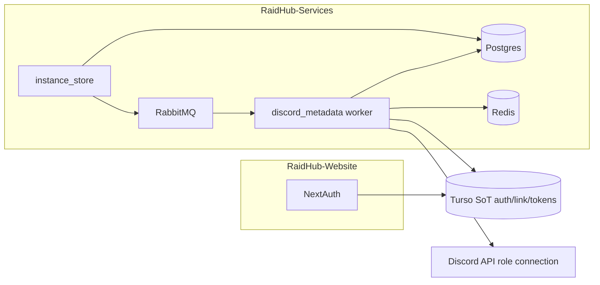
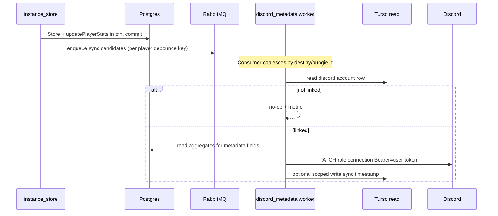

# Discord Linked Roles — PRD, evaluation, and architecture (Option A)

Cross-repo plan. **Parts I–VI** = requirements and architecture; **Part VII** = **v1 ship spec** (enough detail to implement and deploy in one pass). Update Part VII when reality diverges.

**Branches & PR order:** [LINKED_ROLES_EXECUTION.md](./LINKED_ROLES_EXECUTION.md).

---

## Part I — Product requirements (PRD)

### Problem

Players want Discord servers to grant roles from RaidHub-visible criteria (e.g. clears). Admins use Discord Linked Roles. RaidHub already separates **web auth** (Bungie + linked providers) from **raid data** (Postgres / services).

### Actors

- **Player** — link Discord, understand sync status, recover when broken.
- **Guild admin** — rules match documented metadata; roles update after criteria change.
- **Operators** — tokens safe, costs bounded, observable failures.

### Functional requirements

| ID | Requirement |
|----|----------------|
| FR-01 | Signed-in user can **connect** Discord to their RaidHub (Bungie) identity. |
| FR-02 | User can **disconnect** or **replace** linked Discord; effect on Discord roles follows Discord product rules. |
| FR-03 | **Consent** for scopes needed for linked roles (copy + legal outside this doc). |
| FR-04 | When **authoritative** RaidHub stats that feed linked-role metadata **change**, that user’s Discord application role connection metadata is **updated** so Discord can re-evaluate (within **NFR-08** SLO). |
| FR-04a | **Authoritative moment (clears path):** For stats updated in the **same Postgres transaction** as new instance storage (e.g. `player_stats` / `player` clears in `lib/services/instance_storage/instance.go`), metadata used for those fields **MUST** be computed **after** that transaction commits. **Primary sync trigger:** post-commit on new instance (debounced per user — Part III). |
| FR-04b | **Deferred metrics:** Any metadata field sourced from data **not** guaranteed at instance commit (e.g. future fields tied only to `player_crawl` side effects) **MUST** declare a **secondary trigger** (e.g. post-crawl queue) or accept higher staleness in the product matrix. |
| FR-05 | Metadata schema can **evolve** within Discord’s linked-role constraints. |
| FR-06 | User-visible **sync health**: linked or not, and whether RaidHub recently **successfully** pushed metadata (or “needs reconnect” / “pending”). |
| FR-07 | On Discord auth failure, user has a **clear reconnect** path without losing Bungie account. |
| FR-08 | No presenting eligibility RaidHub cannot justify from last successful push + known stats rules (product copy balances honesty vs Discord lag). |
| FR-09 | Admins see metadata fields **consistent** with RaidHub documentation. |
| FR-10 | Only **intended** metadata keys go to Discord linked roles. |

### Non-functional requirements

| ID | Requirement |
|----|----------------|
| NFR-01 | **Source of truth** for auth and **Discord ↔ Bungie** linkage + OAuth tokens: **RaidHub-Website DB** (Turso + Prisma / NextAuth). |
| NFR-02 | **Source of truth** for raid clears and gameplay aggregates: **RaidHub-Services Postgres** (and related stores), not Turso. |
| NFR-03 | OAuth secrets: least privilege, no logging of tokens, rotation story for operators. |
| NFR-04 | Linking/login UX **does not** hard-depend on worker health; **staleness** may increase if workers fail (see NFR-08). |
| NFR-05 | Discord + internal **rate limits**: coalesce/debounce; caps per time window. |
| NFR-06 | Metrics: attempts, success, failure class, latency; avoid high-cardinality PII in labels. |
| NFR-07 | Deletion / unlink: retention and cleanup align with policies (existing Prisma relations). |
| NFR-08 | **Eventual consistency** with explicit **max staleness SLO** (product sets numeric target). |
| NFR-09 | **Single writer** for OAuth token **refresh** unless an ADR introduces a second writer with merge rules. |
| NFR-10 | No second **authoritative** auth DB; read replicas / projections are non-authoritative. |

---

## Part II — PRD evaluation (self-check)

| Area | Assessment |
|------|------------|
| FR-04 split | **Fixed:** FR-04a/04b remove ambiguity between “instance committed” vs “async crawl” using **code-verified** behavior: many clear counters update **pre-commit** in `instance_storage.Store` → **post-commit enqueue** is sufficient for those fields. |
| FR-06 | Still needs **one** chosen persistence (Part III §6). |
| FR-08 vs NFR-08 | Product must set **SLO** numeric target; engineering implements debounce + queue lag budgets under it. |
| NFR-09 | **Critical:** worker must not silently fork token refresh without BFF coordination. |

---

## Part III — Architecture (Option A): workers read Turso

### Goals

- **Writes:** NextAuth / BFF only for `account` token rows and linkage (NFR-01, NFR-09 default).
- **Reads:** Go workers (Hermes-managed queue) read Turso with a **dedicated credential** to resolve Discord OAuth + map **Destiny `membershipId`** (from instances) → **Bungie id** → `account` (`provider = discord`).
- **Stats:** Read from Postgres after commit (NFR-02); same transaction already updates many aggregates used for clears-style metadata (**FR-04a**).

### Context diagram



### Sequence (happy path)



### Identity resolution (repo-accurate)

- **Instance DTO** (`RaidHub-Services/lib/dto/instance.go`): players carry **Destiny** `membershipId` / `membershipType` in `PlayerInfo`.
- **Turso** (`RaidHub-Website/prisma/schema.prisma`): `destiny_profile.destiny_membership_id` → `bungie_membership_id` → `account` row for Discord.
- Resolver: **Destiny membership id (+ type if needed)** → SQL against Turso → Discord `providerAccountId` + tokens.

### Hermes / messaging

- **Queue name (v1):** `discord_role_metadata_sync` — constant in `RaidHub-Services/lib/messaging/routing/constants.go`, worker file `lib/messaging/queue-workers/discord_role_metadata_sync.go` (or equivalent), register in `RaidHub-Services/apps/hermes/main.go` next to other topics.
- **Producer:** `RaidHub-Services/lib/services/instance_storage/orchestrator.go` — after successful `tx.Commit()` and **only when** `instanceIsNew` (same gate as `InstanceParticipantRefresh` today), publish one message per **distinct** `inst.Players[i].Player.MembershipId` (Destiny membership id, int64). **Payload shape — see Part VII §3.**
- **Debounce:** Redis — see Part VII §4.

### Turso credentials

| Token type | Purpose |
|------------|---------|
| Read (SELECT on `account`, `destiny_profile`, `bungie_user`) | Resolve linkage + read `access_token` / `refresh_token` / `expires_at` / `scope`. |
| Optional narrow write | **Only** if FR-06 chooses worker-updated columns (see §6); limit to `UPDATE ... SET discord_metadata_synced_at`, etc. Never arbitrary OAuth writes from Go without ADR. |

### Discord OAuth (Website) gaps today

- `RaidHub-Website/src/lib/server/auth/index.ts`: Discord authorize URL uses **`scope=identify` only** — linked roles need **`role_connections.write`** (and retain `identify` for linking). **Re-link** required for existing Discord-linked users after scope change (**FR-03**).

### Keeping Discord OAuth up to date (NFR-03, NFR-09, FR-07)

**Current codebase behavior**

- Discord tokens are stored on **link** via `PrismaAdapter.linkAccount` (`account.access_token`, `refresh_token`, `expires_at`, `scope`).
- **Bungie** tokens are proactively refreshed in `sessionCallback` (`refreshBungieAuth`); **RaidHub** JWT is refreshed there too. There is **no** equivalent **Discord** refresh on session load today — Turso can hold an **expired** Discord `access_token` until the user re-authenticates with Discord or something else updates the row.

**What “up to date” must cover**

1. **Access token** — short-lived; must be refreshed before calling Discord APIs (linked-role metadata PATCH, or any `@me` call).
2. **Refresh token** — Discord may rotate it on refresh; persist the **new** refresh token whenever Discord returns one.
3. **Scopes** — adding `role_connections.write` requires **re-consent**; old rows are insufficient until the user completes OAuth again (**FR-03**).
4. **Revocation** — user disconnects app in Discord or RaidHub unlinks; Turso row removed/updated; workers must **no-op** gracefully.

**Recommended implementation (BFF as single refresh writer)**

| Mechanism | Role |
|-----------|------|
| **Session-time refresh** | Extend server session path (same idea as `refreshBungieAuth` in `sessionCallback.ts`): if user has `account` where `provider = discord` and access token missing or `expires_at` within a **skew buffer** (e.g. 5 minutes), call Discord `POST https://discord.com/api/oauth2/token` with `grant_type=refresh_token`, then **`prisma.account.update`** for that provider row. Runs whenever an authenticated session is loaded — keeps Turso warm for users who use the site. |
| **On-demand refresh** | Before BFF-only actions (“Sync linked roles” button) or before any BFF-initiated Discord user API call, run the same helper if near expiry. |
| **Adapter / getUser** | Ensure any code path that loads the user for session includes enough `accounts` data to decide if Discord refresh is needed (today `getUser` / session paths are Bungie-centric in places — implementation must load the Discord `account` row when implementing refresh). |
| **Worker (Hermes)** | v1: **read** token from Turso, call Discord; on **401** / invalid grant → metrics + surface **reconnect** (FR-06/07); **do not** refresh from Go unless a future ADR adds a **single** Turso write path for token rotation. |
| **Optional safety net** | Scheduled job (e.g. daily) calling the **same** refresh helper for users with linked Discord who are “due” — low frequency, bounded batch, same BFF-owned code to avoid splitting refresh logic. Only if session-only refresh leaves too many stale tokens for **inactive** users who never open the site. |

**Why this matters for linked roles**

Background workers can run **minutes after** a raid commit while the player is **not** on the website. If Discord `access_token` is already expired and nothing has refreshed it, the worker’s PATCH fails until the user hits the site (session refresh) or you add worker refresh + write-back (ADR). Tight **access token TTL + session refresh** minimizes that gap; optional **scheduled BFF refresh** narrows it for inactive users if product requires.

### Token refresh policy summary (NFR-09)

- **Default:** only **BFF** refreshes Discord OAuth and **writes** Turso `account` rows.
- **Worker:** use stored access token; on hard auth failure, **no** Go refresh in v1; user reconnect flow.
- **Optional ADR:** worker refresh with one controlled Turso `UPDATE` for tokens only.

### Part IV — Traceability (plan vs PRD)

| PRD | Plan coverage |
|-----|----------------|
| FR-01–03, 07 | Website OAuth + scopes; reconnect UX. |
| FR-04 + 04a | Post-commit queue from `orchestrator.go`; stats from committed Postgres. |
| FR-04b | Explicit per-field trigger table when new metadata added. |
| FR-05–10 | Metadata module + Discord app schema versioning + docs site. |
| NFR-01–02 | Turso read + Postgres reads; no duplicate SoT. |
| NFR-03–07 | Read token, metrics, no token logs, Redis debounce. |
| NFR-08–10 | SLO TBD product; single refresh writer default. |

### Part V — Codebase alignment checklist

| Component | Today | Plan touch |
|-----------|--------|------------|
| `RaidHub-Website` … `auth/index.ts` | Discord `identify` only | Add `role_connections.write`. |
| `RaidHub-Website` … `sessionCallback.ts` | Refreshes Bungie + RaidHub JWT only | Add **Discord** access-token refresh (mirror Bungie pattern) so Turso stays valid for workers. |
| `RaidHub-Website` … `prisma/schema` | `account` holds tokens | Optional columns for FR-06. |
| `RaidHub-Services` … `orchestrator.go` | Publishes subscription stage 1 | Also publish discord sync intent. |
| `RaidHub-Services` … `routing/constants.go` | No discord metadata queue | Add constant + worker. |
| `RaidHub-Services` … Hermes | Registers topics | Register new topic. |
| Go | No Turso | New `lib/database/turso` or similar + env. |
| `RaidHub-API` | User JWT + Discord **invocation** JWT | Unchanged for linked roles v1 (different concern than Turso user OAuth). |
| `raidhub-discord` Python | Slash commands → API | Unchanged for linked roles v1. |

### Part VI — Deferred (post-v1 or product-owned)

- **NFR-08 numeric SLO** — set in monitoring runbooks once traffic is observed (Part VII gives interim targets).
- **Worker-side OAuth refresh** + Turso token write-back — only via ADR if session + optional cron are insufficient.
- **Metadata fields** tied exclusively to `player_crawl` — add **FR-04b** second consumer when those fields ship.

---

## Part VII — v1 ship spec (compact execution)

Use this section as the **single implementation brief**. Assumes Option A (Hermes worker reads Turso + Postgres, pushes Discord).

**Cross-repo review (automated + schema audit, 2026-05-03):** Prisma `Account.userId` maps to SQL **`account.bungie_membership_id`** (join fix in §5). `core.player.membership_id` is **`BIGINT`**. Hermes declares queues in **`apps/hermes/topic_manager.go`**, not `lib/messaging/processing`. NextAuth provider id remains **`discord`**.

### 1) Locked v1 decisions (no bikeshedding for first ship)

| Topic | v1 choice |
|-------|-----------|
| FR-06 | **Metrics-first:** Prometheus counters/histograms on worker + BFF refresh failures; **no** new Prisma columns required for first prod ship. Add Turso `account` sync columns in v1.1 if UX needs “last synced” in-app. |
| Queue payload | **One Rabbit message per affected Destiny `membership_id`** per new instance (dedupe distinct players in producer). |
| Debounce TTL | **300 seconds** per Destiny membership id (Redis). |
| Worker token refresh | **No** — BFF-only refresh; worker on 401 → metric + stop. |
| Feature gate | **Env** `DISCORD_LINKED_ROLES_ENABLED` (Go): when `false` / `0` / unset, **producer** in `orchestrator.go` **must not** publish (no queue backlog). **Hermes** still registers the topic so deploys are uniform; worker **first line** may also no-op when disabled to drain any in-flight messages after a flag-off rollback. Document in `RaidHub-Services/example.env`. |
| Interim SLO | Target **P95** queue wait + processing **&lt; 15 minutes** under normal load; tune after metrics. |

### 2) Discord Developer Portal (before code merge)

1. Same **Discord Application** as production OAuth client used by `RaidHub-Website` (`DISCORD_CLIENT_ID`).
2. **Linked roles** → configure **Application Role Connection Metadata** (field keys you will send in JSON `metadata` map — use **snake_case** keys matching Discord schema, values **strings** per Discord API).
3. Note **Application ID** (often equals client id) for URL path — store as `DISCORD_APPLICATION_ID` in worker env (verify in portal if differ).
4. OAuth2 redirect URLs unchanged unless you add routes.
5. After scope change, communicate **“Reconnect Discord”** for existing linked users.

**References (official):**

- [Configuring app metadata for linked roles](https://discord.com/developers/docs/tutorials/configuring-app-metadata-for-linked-roles)
- [Application Role Connection Metadata object](https://discord.com/developers/docs/resources/application-role-connection-metadata)
- [Update Current User Application Role Connection](https://discord.com/developers/docs/resources/user#update-current-user-application-role-connection) — **`PUT`** `https://discord.com/api/v10/users/@me/applications/{application.id}/role-connection` (requires OAuth2 access token with **`role_connections.write`** for that `application.id`).

### 3) Rabbit message schema (v1)

**Queue:** `discord_role_metadata_sync`

**Body (JSON):**

```json
{
  "schemaVersion": 1,
  "trigger": "instance_new",
  "destinyMembershipId": "12345678901234567890",
  "instanceId": 16787546313
}
```

| Field | Type | Notes |
|-------|------|--------|
| `schemaVersion` | int | Bump when payload incompatible. |
| `trigger` | string | v1: always `instance_new`. |
| `destinyMembershipId` | string | Decimal string of `PlayerInfo.MembershipId` from `dto.Instance` (JSON marshals int64; consumer accepts string for bigint safety). |
| `instanceId` | int64 | For logs/metrics correlation only; worker may ignore for metadata computation. |

**Producer:** `orchestrator.go` after commit, inside `if instanceIsNew { ... }`, loop `inst.Players`, build `set` of `MembershipId`, for each publish one message. **Guard** with `DISCORD_LINKED_ROLES_ENABLED`.

### 4) Redis debounce (v1)

- **Key:** `discord_lr:debounce:{destinyMembershipId}` (string id).
- **Op:** `SET key 1 NX EX 300` — if `SET` fails (key exists), consumer **acks without work** (metric: `discord_lr_debounce_skip_total`).
- **Where:** Hermes worker process (same Redis singleton as clan cache — `RaidHub-Services/lib/database/redis`).

### 5) Turso read contract (v1)

**Driver:** Go `database/sql` + Turso/libSQL official client (see [Turso Go SDK](https://docs.turso.tech/sdk/go/reference) at ship time; package/import path may change — pin version in `go.mod`).

**Env (Services):**

| Variable | Required | Purpose |
|----------|----------|---------|
| `TURSO_AUTH_DB_URL` | yes | `libsql://...` URL for **read** token (prefer read-only token from Turso dashboard). |
| `TURSO_AUTH_DB_TOKEN` | yes | Auth token for that URL. |

**Resolve Discord row by Destiny membership id** (SQLite table names from Prisma `@@map`; Prisma field `Account.userId` → SQL column **`bungie_membership_id`**, not `user_id`):

```sql
SELECT a.access_token, a.refresh_token, a.expires_at, a.scope, a.provider_account_id
FROM account AS a
INNER JOIN destiny_profile AS d
  ON d.bungie_membership_id = a.bungie_membership_id
WHERE a.provider = 'discord'
  AND d.destiny_membership_id = ?
LIMIT 1;
```

- `?` = string destiny id (matches `destiny_profile.destiny_membership_id` text).
- If **`destiny_profile.bungie_membership_id` is NULL** for that row, the join yields no account — treat as **unlinked** (same metric path as missing Discord account).
- If **no row:** increment `discord_lr_unlinked_total`, return (success no-op).
- **Never** log `access_token` / `refresh_token`.
- **`expires_at`:** stored as Unix **seconds** (Prisma `Int?`); compare with `time.Now().Unix()` in worker when deciding whether token is likely stale (still prefer BFF refresh policy; worker may proceed and rely on Discord HTTP status).

### 6) Postgres reads for metadata (v1 minimal)

Implement **one** metadata builder in the worker (same package pattern as other Postgres access — use existing `postgres.DB` / `search_path`).

- **Table:** `core.player` — column `clears` (see `infrastructure/postgres/migrations/002_core_schema.sql` and `lib/services/instance_storage/instance.go` `UPDATE player`).
- **Join key:** `core.player.membership_id` (**`BIGINT`**, not `INTEGER`) = int64 parsed from `destinyMembershipId` message field. Application SQL elsewhere uses unqualified `player` and relies on DB **`search_path`** including `core` (`infrastructure/postgres/init/setup.sql`); qualified `core.player` is safest in new worker SQL.
- **v1 example metadata map:** `{ "<portal_key>": "<decimal string>" }` — `<portal_key>` must **exactly** match a key in Discord **Application Role Connection Metadata** (portal may type it as INTEGER; HTTP body still uses **string** values per [API](https://discord.com/developers/docs/resources/user#update-user-application-role-connection)).
- **Extension:** per-activity clears from `core.player_stats` when product registers more metadata fields (same worker, same txn as `core.player` read).

### 7) Discord HTTP call (worker)

- **Method:** `PUT`
- **URL:** `https://discord.com/api/v10/users/@me/applications/{DISCORD_APPLICATION_ID}/role-connection`
- **Header:** `Authorization: Bearer {access_token from Turso}`
- **Header:** `Content-Type: application/json`
- **Body (JSON params per Discord):** all keys optional, but linked roles need **`metadata`** populated. Minimum v1: `{ "platform_name": "RaidHub", "metadata": { "<key>": "<string ≤100 chars>" } }`. Optional: `platform_username` (e.g. Bungie global name) — max 100 chars per API. **`platform_name`** max 50 chars. Keys in `metadata` must match **Application Role Connection Metadata** keys from the Developer Portal.

**Errors:**

| Condition | Action |
|-----------|--------|
| HTTP 401 / invalid OAuth | `discord_lr_discord_auth_fail_total`; do not retry body indefinitely — DLQ or limited retry per Hermes policy. |
| HTTP 429 | Respect `Retry-After`; Hermes retry should backoff. |
| 5xx | Retry with existing worker retry semantics. |

### 8) Website (BFF) — required code paths

| Step | File / area | Action |
|------|-------------|--------|
| W1 | `src/lib/server/auth/index.ts` | Discord authorize URL: scopes **`identify` + `role_connections.write`** (space-separated in `scope` query param). |
| W2 | `src/lib/server/auth/sessionCallback.ts` (+ small `discordRefresh.ts`) | Load Discord `account` for `user.id`; if `expires_at` null or within **300s** of expiry, `POST https://discord.com/api/oauth2/token` with `client_id`, `client_secret`, `grant_type=refresh_token`, `refresh_token`; update `account` access/refresh/expires. |
| W3 | Adapter `getUser` / session includes | Ensure session load can read Discord `account` fields needed for W2 (extend Prisma `include` where only Bungie `accounts` is loaded today — `adapter.ts` paths). |
| W4 | (Optional v1) | Server action “Sync Discord roles” calling same refresh helper then **same** `PUT` role-connection as worker **or** rely on worker only — product choice; if omitted, inactive users depend on session visits for token freshness. |

**Website env:** reuse `DISCORD_CLIENT_ID` / `DISCORD_CLIENT_SECRET` for refresh endpoint.

### 9) Observability (minimum viable)

| Metric (Prometheus) | Type | Labels (low cardinality) |
|---------------------|------|----------------------------|
| `discord_lr_publish_total` | counter | `result` = ok \| fail |
| `discord_lr_work_total` | counter | `result` = ok \| debounce_skip \| unlinked \| discord_4xx \| discord_5xx \| panic |
| `discord_lr_work_duration_seconds` | histogram | none or `result` ok only |

Logs: always log `destinyMembershipId`, `instanceId`, `trigger`; never log tokens.

### 10) Rollout checklist (prod order)

1. Portal: metadata schema published.
2. Deploy **Website** with new scopes + refresh logic; monitor OAuth errors.
3. Run comms: existing users **Reconnect Discord**.
4. Create Turso **read** credential; store in secrets manager for **Hermes** (not in repo).
5. Set `DISCORD_APPLICATION_ID` + `TURSO_*` + `DISCORD_LINKED_ROLES_ENABLED=false` on workers.
6. Deploy **Services** binary with producer + worker + Redis debounce **disabled**.
7. Enable `DISCORD_LINKED_ROLES_ENABLED=true` on **canary** Hermes; watch metrics + Discord dev dashboard.
8. Full enable; set alert on `discord_lr_discord_auth_fail_total` rate.

**Rollback:** set `DISCORD_LINKED_ROLES_ENABLED=false`; redeploy or hot-reload env; queue drains or DLQ clears per ops policy.

### 11) Environment variables (copy checklist)

**RaidHub-Services (Hermes / worker + producer)**

| Variable | Example | Who sets |
|----------|---------|----------|
| `DISCORD_LINKED_ROLES_ENABLED` | `true` / `false` | ops |
| `DISCORD_APPLICATION_ID` | snowflake string | ops (Portal → Application ID) |
| `TURSO_AUTH_DB_URL` | `libsql://...` | ops (read-capable token) |
| `TURSO_AUTH_DB_TOKEN` | secret | ops |

**RaidHub-Website (existing + behavior)**

| Variable | Notes |
|----------|--------|
| `DISCORD_CLIENT_ID` / `DISCORD_CLIENT_SECRET` | Already used for OAuth; refresh token POST reuses these. |

### 12) Local / CI dev notes

- **Website local DB** is file SQLite (`APP_ENV=local`) — no Turso unless pointed at branch; **worker integration** against Turso needs `TURSO_*` to a dev database or skip worker in CI.
- **Hermes** needs Redis + Rabbit + Postgres + Turso reachable from Docker network if worker runs in compose.
- Add **`example.env` entries** in `RaidHub-Services` for all new vars (copy-paste documented).

### 13) Explicit non-goals (v1)

- No changes to `RaidHub-API` user JWT, `raidhub-discord` Python bot, or subscription webhooks for linked roles.
- No Postgres table for Discord user id (Turso remains SoT).
- No worker-written OAuth tokens.

### 14) One-page implementation order (for agents / humans)

1. Portal: metadata keys + linked roles tutorial complete.
2. Website: scopes (`index.ts`).
3. Website: Discord refresh + adapter/session includes (`sessionCallback`, `adapter.ts`, small helper).
4. Services: `example.env` + register vars in `lib/env/env.go` (`getEnv` / `getEnvWithDefault` pattern — see existing `DISCORD_*` optional vars).
5. Services: `routing/constants.go` + message struct (same package as other `messages/*.go`).
6. Services: producer loop in `orchestrator.go` behind `DISCORD_LINKED_ROLES_ENABLED`.
7. Services: Turso client package + resolver SQL (§5).
8. Services: worker topic + Redis debounce (§3–4) + Postgres metadata (§6) + Discord PUT (§7).
9. Services: Hermes `main.go` register topic.
10. Metrics + dashboards (§9).
11. Staging e2e: link Discord → finish raid → observe PUT + role in test server.
12. Prod rollout (§10).

### 15) RabbitMQ / Hermes wiring note

Queues are **not** statically listed in `infrastructure/rabbitmq/definitions.json` (empty `queues` array). **Declaration:** `RaidHub-Services/apps/hermes/topic_manager.go` — durable queue named `TopicConfig.QueueName`, bound to delayed exchange `hermes.delayed` with routing key = queue name, then consume (same as all Hermes topics).

**Registration:** append `qw.YourTopic()` to the `topics` slice in `apps/hermes/main.go` (see lines ~77–89 today).

**TopicConfig:** defined in `lib/messaging/processing/topic.go`. For outbound Discord HTTP (no Bungie), mirror **`subscription_delivery.go`** (prefetch `1`, `KeepInReady: true`, higher `MaxRetryCount`, custom retry delay for 429). Do **not** add `BungieSystemDeps` unless the worker calls Bungie.

**Publish:** `publishing.PublishJSONMessage(ctx, routing.<Constant>, payload)` — queue name string must match `routing` constant exactly.

---

## Revision history

| Date | Change |
|------|--------|
| 2026-05-03 | Initial consolidated PRD + Option A plan; FR-04a grounded in `instance_storage` transactional clears update. |
| 2026-05-03 | §Keeping Discord OAuth up to date: current gap vs session/on-demand/worker policy. |
| 2026-05-03 | **Part VII** v1 ship spec: locked defaults, schemas, SQL, APIs, env, rollout, non-goals. |
| 2026-05-03 | Part VII tightened: `core.player`, env table, impl order §14, Rabbit note §15. |
| 2026-05-03 | **Deep review:** fix Turso SQL join (`bungie_membership_id` not `user_id`); `BIGINT` + `search_path` note; Discord PUT + `role_connections.write`; Hermes `topic_manager.go`; lock feature-flag semantics; API body optional fields. |
